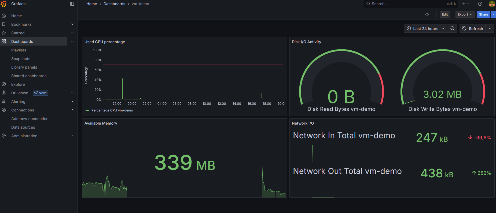
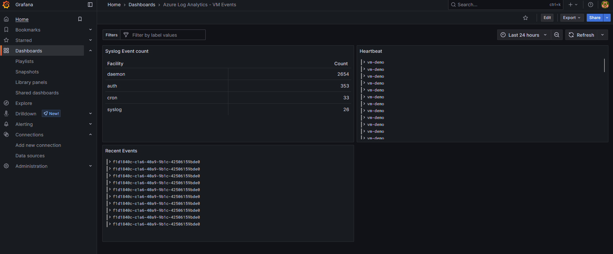

# 📊 Grafana Module

This module provisions a Linux VM running Grafana using `cloud-init`, and exposes it publicly on port `3000`. It also installs the Azure Monitor Agent (AMA) to collect performance metrics via DCR, and provides reusable dashboards via JSON templates.

---

## 📦 Resources Created

- `azurerm_public_ip` – Static public IP for external access  
- `azurerm_network_interface` – NIC linked to subnet and public IP  
- `azurerm_network_security_group` – NSG with rules for SSH and Grafana  
- `azurerm_network_security_rule` – Allows inbound traffic on ports `22` and `3000`  
- `azurerm_network_interface_security_group_association` – Binds NSG to NIC  
- `azurerm_linux_virtual_machine` – Ubuntu VM with Grafana installed via cloud-init  
- `azurerm_virtual_machine_extension` – Installs Azure Monitor Agent (AMA)

---

## 📥 Input Variables

| Name                  | Type    | Description                             | Required |
|-----------------------|---------|-----------------------------------------|----------|
| `resource_group_name` | string  | Name of the resource group              | ✅ Yes   |
| `location`            | string  | Azure region for deployment             | ✅ Yes   |
| `admin_username`      | string  | SSH username to access the VM           | ✅ Yes   |
| `ssh_public_key`      | string  | Public key for secure SSH access        | ✅ Yes   |
| `subnet_id`           | string  | Subnet ID for VM network attachment     | ✅ Yes   |

---

## 📤 Outputs

| Name                | Description                          |
|---------------------|--------------------------------------|
| `grafana_public_ip` | Public IP of the Grafana VM          |

---

## 📈 Included Dashboards

The module contains ready-to-use Grafana dashboards exported as JSON templates:

### 1. `vm-demo-dashboard-template.json`
- Monitors CPU, memory, disk, and network usage
- Threshold markers on CPU usage
- Suitable for Azure VMs using the Azure Monitor datasource

### 2. `lab-law-logs-dashboard-template.json`
- Uses Azure Log Analytics to query logs
- Displays heartbeat, syslog facility distribution, and recent events

📁 Templates located at:  
`grafana/dashboards/*.template.json`

> ⚠️ Production dashboards with real identifiers are excluded via `.gitignore` to ensure security.

---

## 📷 Screenshots

You may include screenshots such as:

- 
- 

To preview dashboard layouts and structure. Place them under `grafana/screenshots/` or link externally.

---

## 🧪 Example Usage

```hcl
module "grafana" {
  source              = "./modules/grafana"
  resource_group_name = azurerm_resource_group.rg.name
  location            = var.location
  admin_username      = var.admin_username
  ssh_public_key      = var.ssh_public_key_content
  subnet_id           = module.network.subnet_id
}
```
---

## ⚙️ Notes

- VM runs Ubuntu 22.04 LTS
- Grafana installed via APT using official repository via cloud-init
- AMA agent enables performance data collection for Azure Monitor + Log Analytics
- Port 3000 open via NSG for external dashboard access
- SSH access via provided public key
- Dashboards versioned safely as templates; .gitignore excludes sensitive exports

---

## 🧑‍💻 Author

Daniel Gil